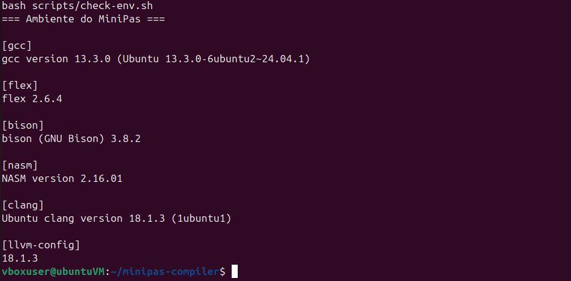
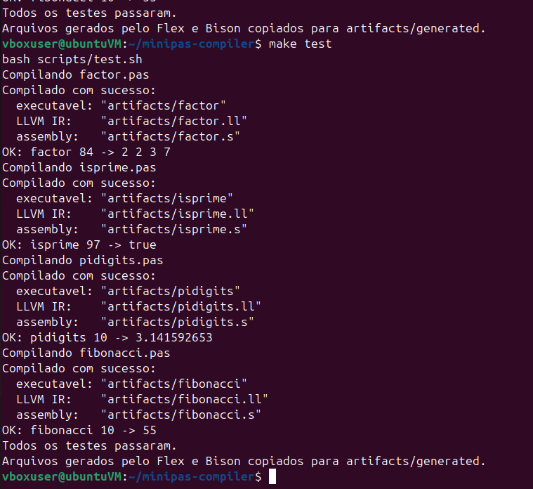
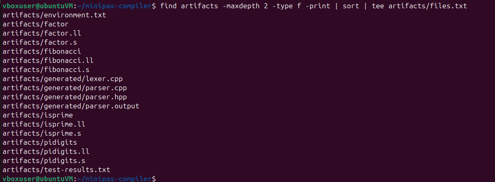

# Evidencias de execucao

As evidencias abaixo foram obtidas em uma maquina virtual Ubuntu 24.04 x86-64.
Os arquivos de texto correspondentes tambem estao versionados em `artifacts/`.

## 1. Ambiente

O ambiente foi verificado com `make environment`. Versoes registradas:

- GCC 13.3.0;
- Flex 2.6.4;
- Bison 3.8.2;
- NASM 2.16.01;
- Clang 18.1.3;
- LLVM 18.1.3.



Saida completa: [`artifacts/environment.txt`](../artifacts/environment.txt).

## 2. Compilacao e testes

O comando `make test` compilou os quatro fontes MiniPas, gerou os executaveis
nativos e comparou cada saida com o resultado esperado:

| Programa | Entrada | Resultado |
|---|---:|---|
| `factor.pas` | 84 | `2 2 3 7` |
| `isprime.pas` | 97 | `true` |
| `pidigits.pas` | 10 | `3.141592653` |
| `fibonacci.pas` | 10 | `55` |



Saida completa: [`artifacts/test-results.txt`](../artifacts/test-results.txt).

## 3. Artefatos gerados

Foram preservados no repositorio:

- executavel Linux de cada programa;
- LLVM IR (`.ll`) de cada programa;
- assembly x86-64 (`.s`) de cada programa;
- scanner C++ produzido pelo Flex;
- parser, header e relatorio de estados produzidos pelo Bison;
- versoes do ambiente e resultado automatizado dos testes.



Lista em texto: [`artifacts/files.txt`](../artifacts/files.txt).

## 4. Reproducao

```bash
git clone https://github.com/GustavoBerengani/minipas-compiler.git
cd minipas-compiler
sudo apt install build-essential flex bison llvm-dev clang nasm
make clean
make test
```

As imagens mostram a saida real do terminal e nao tiveram seus resultados
alterados.
